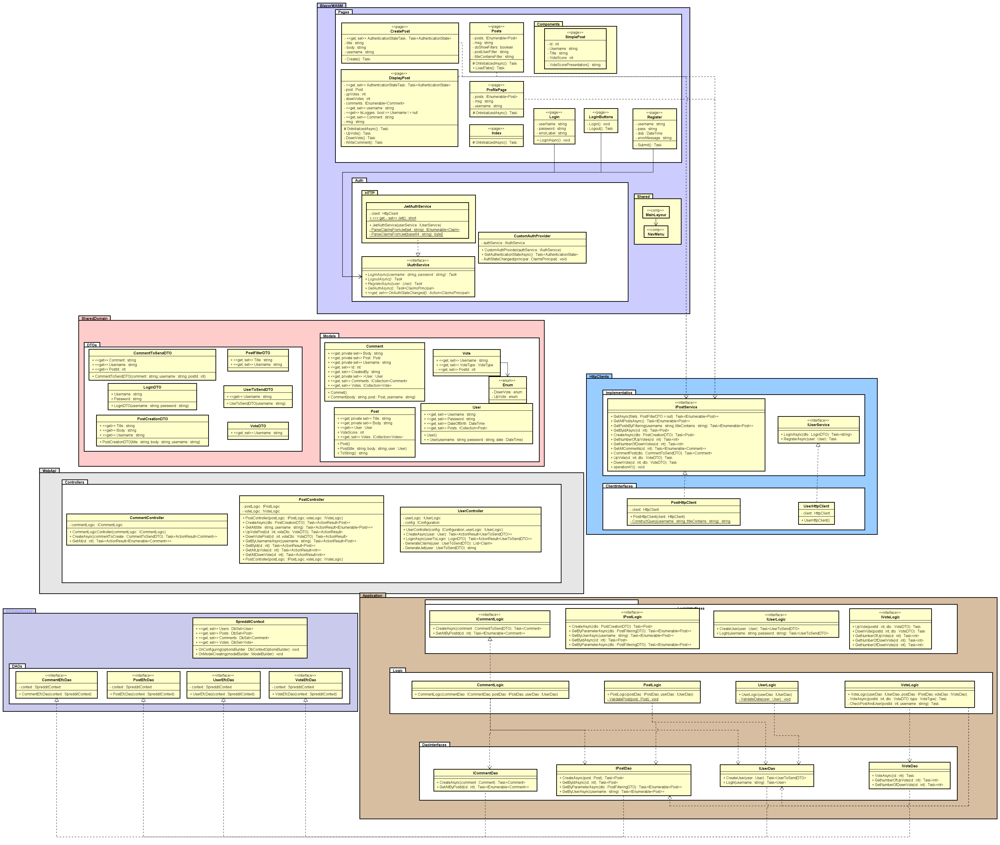

# .NET Handin 3
We decided to divide our group, only Beatricia Nagit and Gergo Nador contributed to this part of the project.

Honorable mention: Agata Rudol for helping us with the part 1 and 2.

Part two repository: https://github.com/Agarud9/Spreddit

Changes: Added Entity Framework

## Show off
Video: https://www.youtube.com/watch?v=JUyOLD4QhgU

## Class diagram

## Requirements

1.	As a User I want to be able to Register (Username, password, date of birth) DONE
2.	As a User I want to be able to log in (Username, password) NOT NOW
3.	As a User I want to be able to log out NOT NOW
4.	As a User I want to be able to create a new post (title, body, username, [id]) BETI
5.	As a User I want to be able to view all posts (just titles) BETI
6.	As a User I want to be able to view the specific post (title) AGATA
7.	As a User I want to be able to add comments to the post (username, comment, post’s id) AGATA
8.	As a User I want to be able to upvote/downvote a post (up/down, username, post id) GERGO DONE
9.	As a User I want to be able to see my profile page so that I will see all my posts with their comments and upvotes or downvotes (username) GERGO
10. As a User I want to be able to see all posts so that I will have an overview.
11. As a user I want to be able to delete my own posts so that I can clean my profile.

Task:
1. Register view
2. Login view 
3. Display all posts with filtering(title, Username) not obligatory to be logged in Beti
4. Display one post with comments and votes(make endpoint for getById) not obligatory to logged in Agata
5. My profile(Username with user's posts) Greg
6. Create Post button with page. Agata
7. Log out button.
